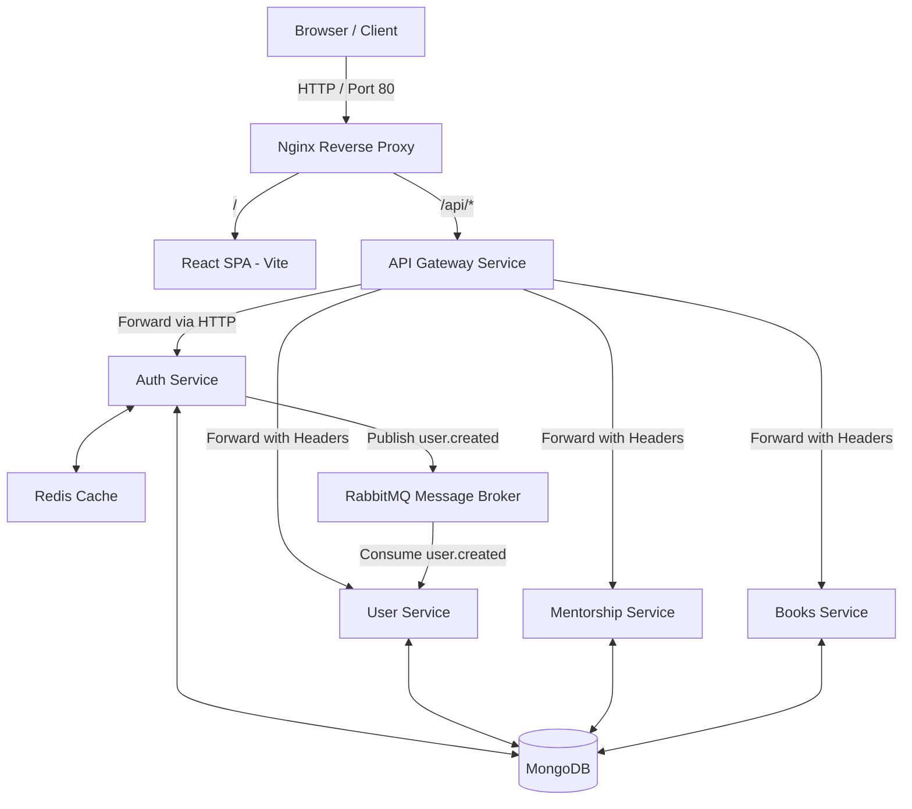

# MentorHub Mentorship App

A containerized, event-driven microservices mentorship application. It enables students to browse books/resources, request career counseling sessions, interact with an AI Career Advisor, and join virtual face-to-face video rooms.

---

## 🏗️ Architecture & Tech Stack

### System Diagram


### Components
1. **nginx (Port 80):** Handles entry reverse proxying. Directs UI requests to the frontend client and `/api/*` to the API gateway.
2. **gatewayservice (Port 5001):** Single entry gateway. Performs JWT verification, global rate limiting, and forwards downstream headers (`x-user-id` and `x-user-role`).
3. **authservice (Port 5002):** Manages signup, login, Google OAuth verification, password recovery emails, token blacklisting via Redis, and issues HTTP-only refresh tokens.
4. **userservice (Port 5003):** Profile manager syncing student and mentor information. Consumes RabbitMQ events to initialize profile database rows asynchronously.
5. **mentorshipservice (Port 5004):** Handles video session bookings, schedules virtual meeting links (Jitsi), creates event logs, and hosts the Hugging Face AI Career Advisor chatbot.
6. **booksservice (Port 5005):** Book/resource hosting library supporting thumbnail and binary file uploads via Cloudinary.
7. **Infrastructure:** MongoDB (isolated databases per service), Redis, RabbitMQ broker.

---

## 🔒 Security Design

### HTTP-only Secure Cookie Authentication
For maximum protection against Cross-Site Scripting (XSS) theft, the app uses **secure HTTP-only cookies** for storing refresh tokens instead of `localStorage`.
- Access tokens are transiently held in memory (Redux) and passed via the `Authorization: Bearer <token>` header.
- Refresh tokens are written to an HTTP-only cookie automatically attached by the browser on `/refresh-token` requests when `withCredentials` is active.

### Strict Environment Validation
Every microservice uses a strict schema validator (`Joi`) at startup. If critical variables (e.g. `JWT_SECRET`, `MONGO_URI`, `RABBITMQ_URL`) are missing or misconfigured, the container logs the failure and crashes early to prevent undefined execution states.

### Secret Manager Compatibility (File-based Secrets)
For production deployments (like Kubernetes or Docker Swarm), the env parser detects `_FILE` suffixes (e.g. `JWT_SECRET_FILE`). When defined, the configuration resolver loads the secret dynamically from the mounted secret files rather than loading plaintext environment strings.

---

## 🔑 Role-Based Access Controls (RBAC) & Ownership

| Endpoint | HTTP Method | Allowed Roles | Ownership Verification Rule |
| :--- | :---: | :---: | :--- |
| `/api/sessions` | `POST` | `STUDENT` | Must be a student to book a mentor. |
| `/api/sessions/:id` | `GET` | `STUDENT`, `MENTOR`, `ADMIN` | User must be the student or mentor of the session. |
| `/api/sessions/:id/timeline` | `GET` | `STUDENT`, `MENTOR`, `ADMIN` | User must be the student or mentor of the session. |
| `/api/sessions/:id/accept` | `PATCH` | `MENTOR` | Mentor must be the assigned mentor. |
| `/api/resources` | `POST` | `MENTOR`, `ADMIN` | MentorId/Uploader must match the creator. |
| `/api/resources/:id` | `PUT` | `MENTOR`, `ADMIN` | Only the creator mentor (uploadedBy) or an ADMIN can edit. |
| `/api/resources/:id` | `DELETE` | `MENTOR`, `ADMIN` | Only the creator mentor or an ADMIN can delete. |

---

## 🚀 Getting Started

### Prerequisites
- Docker & Docker Compose
- Node.js v18+ (for local testing/development)

### Local Configuration
1. Clone the repository.
2. Duplicate `.env.example` to `.env` in the root and configure credentials:
   ```bash
   cp .env.example .env
   ```
3. Set your active keys for Resend, Cloudinary, and Hugging Face in the root `.env` to enable full email notifications and storage features.

### Spin Up Containers
```bash
docker-compose up --build
```
Access the application at `http://localhost`.

---

## 🧪 Running Tests & Quality Checks

Tests are configured using **Vitest** (supporting ES modules natively) and **Supertest** for endpoint testing.

### Run Service Tests
Navigate into the respective service folder:
```bash
cd Backend/authservice && npm run test
cd Backend/booksservice && npm run test
cd Backend/mentorshipservice && npm run test
```

### Run Linter Checks
```bash
cd Backend/gatewayservice && npm run lint
```

---

## 📐 Design Trade-offs & Considerations

### 1. Monolith vs. Microservices
- **Decision:** Split the platform into 5 isolated microservices.
- **Trade-off:** Adds operational overhead (multiple databases, orchestrating networks, gateway overhead) to gain deployment scaling flexibility. For smaller organizations, a monolithic design would simplify testing and transaction consistency.

### 2. Eventual Consistency (RabbitMQ) vs. Distributed Transactions (2PC)
- **Decision:** Use RabbitMQ to sync `authservice` registrations with `userservice` profiles asynchronously.
- **Trade-off:** Prevents database joins. If a network partition occurs, a user might register but face a small delay before their user profile row is created. We chose eventual consistency to ensure auth registration remains high-availability.
